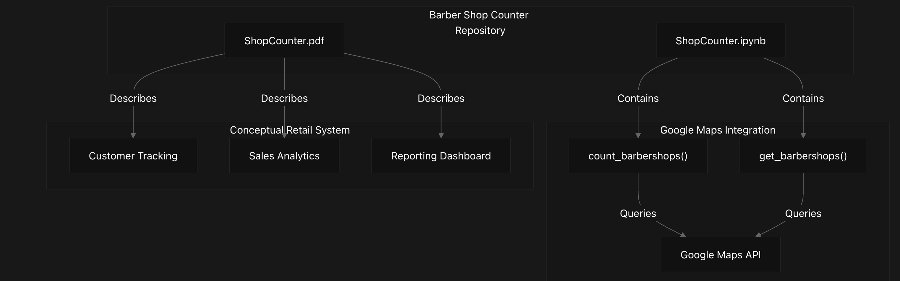
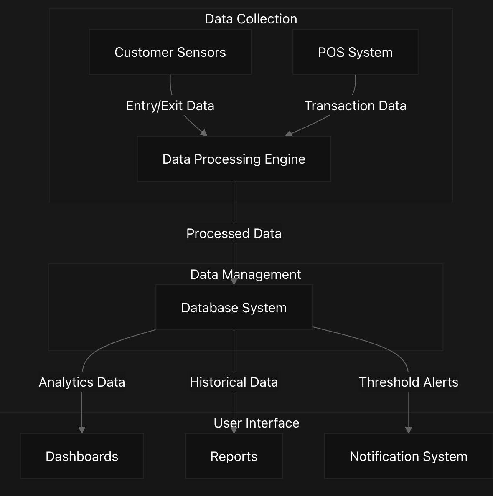

# Overview
The Barber Shop Counter repository provides tools and documentation for barbershop data collection and analysis. It contains two main components:

## Purpose & Scope
A Google Maps API integration system for counting and gathering information about barbershops in specific geographic areas
Documentation for a conceptual retail analytics system for tracking customer flow and sales data
This page introduces both components and their basic architecture. 

Repository Structure
The repository has a simple structure with two primary components:

Barber-Shop-Counter/
├── ShopCounter.ipynb   # Jupyter notebook with Google Maps API integration
└── ShopCounter.pdf     # Documentation for retail analytics system concept

## System Architecture Overview
The following diagram illustrates the high-level architecture of both systems contained in this repository:

### High-Level Architecture

## Google Maps Barbershop Counter
The Jupyter notebook (ShopCounter.ipynb) provides functionality to:

Count the total number of barbershops within a specific radius of a geographic location
Retrieve detailed information about those barbershops (name, address)
Handle API pagination and rate limiting for reliable data collection
The implementation centers around two key functions:

count_barbershops(): Returns the total count of barbershops in an area
get_barbershops(): Returns detailed information about each barbershop

### Google Maps Integration Data Flow

## Conceptual Retail Analytics System
The repository also contains documentation for a conceptual retail analytics system designed to:

Track customer flow in retail environments
Integrate with point-of-sale (POS) systems
Provide real-time dashboards and reports
Support decision-making with sales and customer data analytics
This system is documented but not implemented in code within the repository.

### Conceptual Retail System Architecture

## Key Components and Functionality
### Google Maps API Integration
Component	Purpose	Implementation
count_barbershops()	Counts total barbershops in a geographic area	Function in ShopCounter.ipynb
get_barbershops()	Retrieves detailed information about barbershops	Function in ShopCounter.ipynb
Pagination Handling	Processes multiple pages of API results	Loop with next_page_token in both functions
Rate Limiting	Prevents API usage limits being exceeded	2-second delay between API calls
Sources: 
ShopCounter.ipynb
33-61
 
ShopCounter.ipynb
142-170

### Conceptual Retail Analytics System
Component	Purpose	Notes
Customer Tracking	Monitor store foot traffic	Conceptual, not implemented
Sales Analysis	Process transaction data	Conceptual, not implemented
Dashboarding	Visualize key metrics	Conceptual, not implemented
Reporting	Generate business intelligence	Conceptual, not implemented

## Potential Use Cases
The repository components can support various scenarios:

1. Market Analysis: Using the Google Maps integration to analyze barbershop density in different regions
2. Competitive Intelligence: Identifying barbershop clusters and understanding market saturation
3. Customer Flow Optimization: Applying the retail analytics concepts to barbershop operations
4. Business Performance Tracking: Combining location data with the retail analytics framework

# Shop-Counter Code Notebook
Python Code using Google Maps API to count types of businesses in a location.  'Barbershop' may be substituted for any other type of business or place.

    import googlemaps
    import time
    
    Set Google Maps API Key
    API_KEY = 'YOUR_API_HERE'
    
    Initialize the Google Maps client
    gmaps = googlemaps.Client(key=API_KEY)
    
    Coordinates for Minneapolis-St. Paul metro area
    location = (44.9778, -93.2650)  # Approximate central location for Minneapolis
    
    Define the search radius in meters (you can adjust this as needed)
    radius = 50000  # 50 km
    
    Function to count barbershops
    def count_barbershops(location, radius):
        barbershops_count = 0
        next_page_token = None

    while True:
        if next_page_token:
            places_result = gmaps.places_nearby(
                location=location,
                radius=radius,
                keyword='barbershop',
                page_token=next_page_token
            )
        else:
            places_result = gmaps.places_nearby(
                location=location,
                radius=radius,
                keyword='barbershop'
            )

        barbershops_count += len(places_result['results'])

        next_page_token = places_result.get('next_page_token')
        if not next_page_token:
            break

        time.sleep(2)  # Pause to respect API rate limits

    return barbershops_count

    #Count the barbershops
    barbershops_count = count_barbershops(location, radius)
    print(f'Total number of barbershops in the Minneapolis-St. Paul metro area: {barbershops_count}')
    
    **Total number of barbershops in the Minneapolis-St. Paul metro area: 60**
    
    **Print the details of each barbershop**
    
    for shop in barbershops:
    name = shop.get('name')
    address = shop.get('vicinity')
    print(f'Name: {name}, Address: {address}')

**Name: Jesse's Barber Shop, Address: 14 Shady Oak Rd, Hopkins
Name: Cedarvale Barber Shop, Address: 1977 Silver Bell Rd Suite 800, Eagan
Name: Hero's barbershop llc, Address: 10012 County Rd 81, Maple Grove
Name: Bob's Barber Shop Waconia, Address: 124 W Main St, Waconia
Name: Handle Bars Barber Shop, Address: 318 W Broadway St January 2024, Mont
icello
Name: The Patron Barber, Address: 806 E 7th St #100, St Paul
Name: Hairlounge Barbershop, Address: 1203 Washington Ave S, Minneapolis
Name: Saints Coast Barber Shop, Address: 666 7th St W, St Paul
Name: Quality Cuts Barbershop, Address: 1332 S Robert St #2, St Paul
Name: Stilo Cuts Barber Shop-Uptown, Address: 2655 Hennepin Ave S, Minneapol
is
Name: The Barber Sharp, Address: 349 13th Ave NE, Minneapolis
Name: Cutting Edge Barbershop LLC, Address: 93 85th Ave NW, Coon Rapids
Name: Upper Cutz Barbershop LLC, Address: 3926 Cedar Grove Pkwy, St Paul
Name: Marvin's Barbershop & Beauty salon Minneapolis, Address: 2415 Central
Ave NE, Minneapolis
Name: Elegant Style Barbershop, Address: 7876 University Ave NE, Fridley
Name: Marty's Barber Shop, Address: 212 N 3rd Ave #106, Minneapolis
Name: Stilo Cuts Barber Shop-North Loop, Address: 224 N Washington Ave Suite
130A, Minneapolis
Name: Jefferson Street Barbershop, Address: 11704 Jefferson St NE, Blaine
Name: Craig's Como Barber Shop, Address: 1508 Como Ave SE, Minneapolis
Name: Faded Barbershop Uptown, Address: 2649 Lyndale Ave S, Minneapolis
Name: Neighborhood Barbershop, Address: 938 Payne Ave, St Paul
Name: Lyn-Lake Barbershop, Address: 3019 Lyndale Ave S, Minneapolis
Name: Studio AZ - Barbershop, Address: 333 N Washington Ave Suite #100, Minn
eapolis
Name: Clean Cuts Barber Shop, Address: 611 Marie Ave, South St Paul
Name: Zac's Barbershop, Address: 10551 University Ave NE, Blaine
Name: District One Barbershop, Address: 8320 Egan Dr, Savage
Name: SASHA's Barbershop, Address: 7989 Southtown Dr Suite 408, Bloomington
Name: LV’s Barbershop-Bloomington, Address: 3701 W Old Shakopee Rd #600, Blo
omington
Name: Salam Barbershop, Address: 2215 Central Ave NE, Minneapolis
Name: Nate's Barber Shop, Address: 9416 36th Ave N, New Hope
Name: Barber Mug Barber Shop, Address: 1364 7th St W, St Paul
Name: LV's Barbershop- North East, Address: 2518 Central Ave NE, Minneapolis
Name: Above All Cuts Barbershop, Address: 7899 E River Rd, Minneapolis
Name: Hazim Barber Shop, Address: 4110 Central Ave NE STE 205, Columbia Heig
hts
Name: Floyd's 99 Barbershop - North Loop, Address: 424 N Washington Ave STE
109, Minneapolis
Name: Elizabeth's Barber Shop, Address: 168 Fairview Ave N, St Paul
Name: TR's Barber Shop, Address: 20700 Holyoke Ave, Lakeville
Name: Clean Cuts BarberShop, Address: 1728 University Ave W, St Paul
Name: Floyd's 99 Barbershop - Chanhassen, Address: 530 W 79th St #104, Chanh
assen
Name: Expensive Taste Barbershop, Address: 9100 Hudson Rd #2, Woodbury
Name: Squire & Jello's Barbershop, Address: 1575 Grand Ave, St Paul
Name: Paul's Barber Shop, Address: 1250 126th Ave NE #200, Blaine
Name: A1 Cuts Barbershop, Address: 1215 Arcade St, St Paul
Name: Clippers Barbershop, Address: 1570 Century Point, Eagan
Name: The Barbershop A Hair Salon for Men, Address: 1590 S Robert St, West S
t Paul
Name: Trendz Barbershop, Address: 15465 Cedar Ave, Apple Valley
Name: Vertex Barbershop, Address: 8160 Coller Way, Woodbury
Name: Top Rank Barbers, Address: 4089 W Broadway, Robbinsdale
Name: Chop Shop BarberShop, Address: 1656 Co Rd E East #110, Vadnais Heights
Name: Finelines Barbershop, Address: 6819 York Ave S STE 101, Edina
Name: 210 Barber Shop, Address: 8341 210th St W, Lakeville
Name: Grandview Barber Shop, Address: 1852 Grand Ave, St Paul
Name: Floyd's 99 Barbershop - Edina, Address: 5051 France Ave S, Minneapolis
Name: Colman's Barbershop, Address: 2280 Commerce Blvd, Mound
Name: Cindy's Barber Shop, Address: 5408 Penn Ave S, Minneapolis
Name: Glenn's Barber Shop, Address: 814 W 36th St, Minneapolis
Name: Jim's Barber Shop, Address: 949 Old Hwy 8 NW, New Brighton
Name: Cottage Barber Shop, Address: 168 Lake St N, Forest Lake
Name: Joanne's Barbershop, Address: 8555 Lyndale Ave S, Bloomington
Name: Blue Collar Barbershop, Address: 6131 N 42nd Ave, Crystal**

